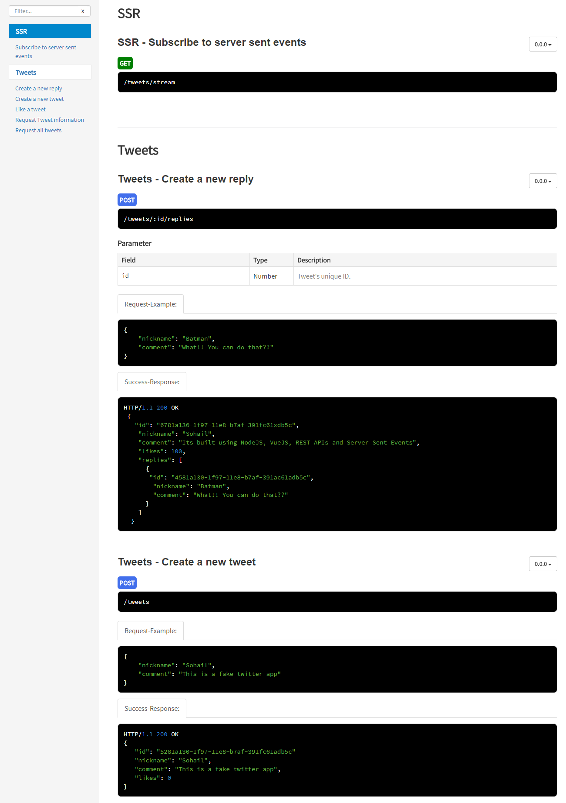
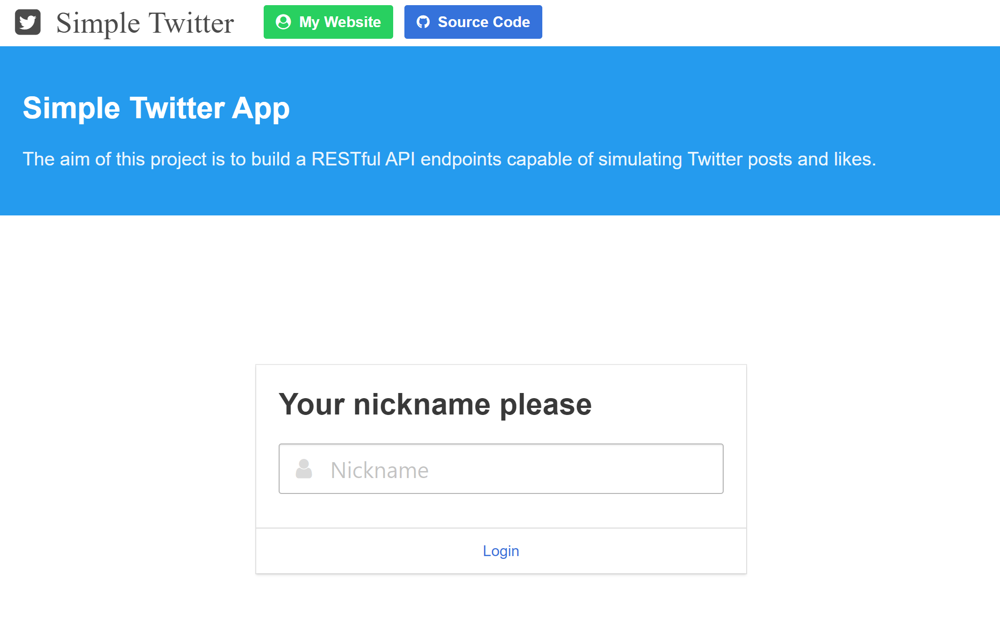
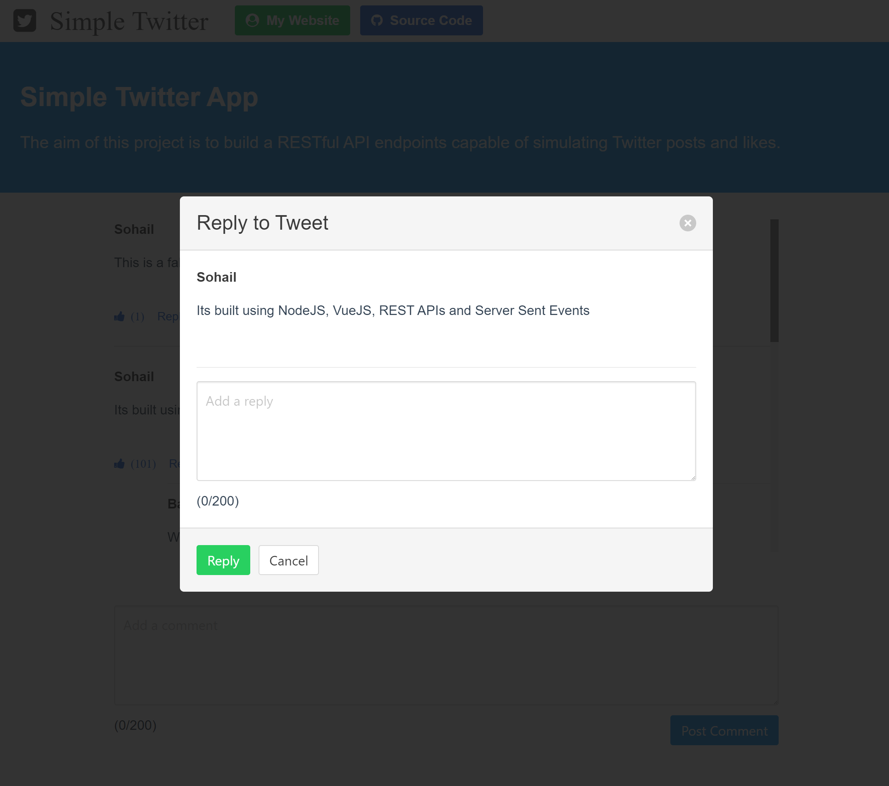

# Simple Twitter Backend
===

## Introduction

The aim of this project is to build a RESTful API endpoints capable of simulating Twitter posts and likes. 

The backend is built using **NodeJs** with **Express** as the REST library and with an additional support for **Server Sent Events** to push updates to clients instantly.
Being a proof of concept work, this backend uses an in-memory database called **LokiJs** which has very similar APIs when compared to **MongoDB** and can be replaced with a real database with very minimal code modifications.  

The frontend is built using **VueJs** with **Vuex** as the centralized state-management store and with an additional support for **Server Sent Events** to receive updates from the server instantly. 
It also uses **Bulma** css framework with **SCSS** as a CSS preprocessor and **PUG** as the templating language. 


Because of the SSE feature, you can open two or more browser tabs / different browsers etc. and you will get immediate updates pushed to you as it happens.

## Requirements

- NodeJs v8 or above
- NPM v5 or above

## Docker Compose

The application can be run individually as backend and frontend as described in their separate README. However, it can 
also be run as follows using docker-compose

```bash
docker-compose up -d
```

Upon running the application, it can be accessed from the port 8080 of the localhost or local ip.

http://localhost:8080/


## Docker Build

The following script can be run to build all docker images and push to the repository 

```bash
./build-docker.sh
```

## Screenshots

### API Doc



### Login Page



### Tweets Feed


### Tweet Reply


